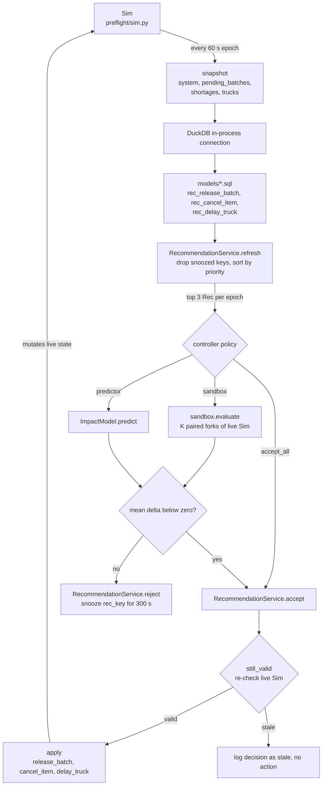
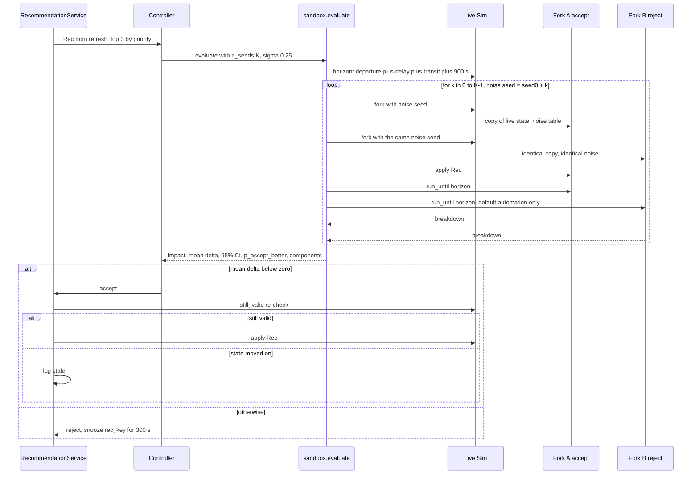
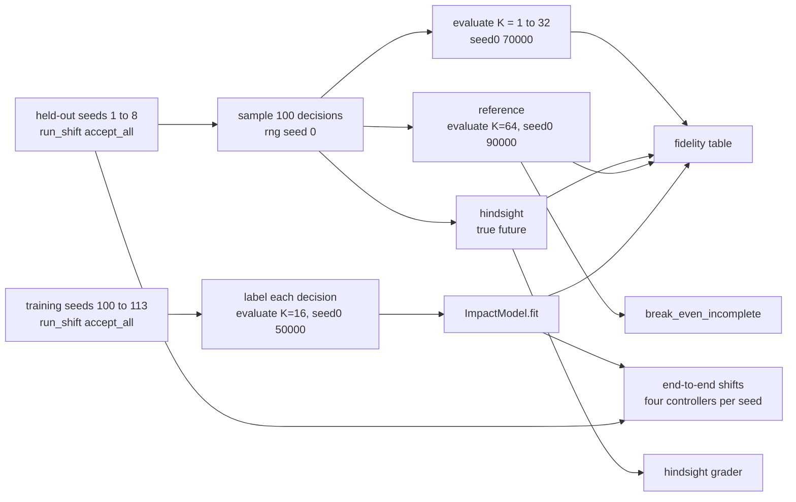

# Preflight

[](https://github.com/ombdj1209/preflight/actions/workflows/ci.yml)

**See the cascade before you click Accept.** A decision-impact sandbox for automated fulfilment centres: a discrete-event simulation of pick stations, a finite conveyor and dock departures; dbt-style SQL recommendation rules; a race-guarded recommendation service; paired counterfactual evaluation of every recommendation; a learned impact predictor; and a hindsight grader that scores past decisions.

All data is synthetic, seeded and reproducible. Nothing here uses or claims knowledge of Picnic's internal systems or data.

## At a glance

- **Question:** how much simulation fidelity is enough to trust a sandbox verdict, and can it run fast enough to show before the click?
- **Answer on this model:** agreement with a K=64 reference saturates at K=4 paired runs, in about 21 ms per decision. Beyond that the remaining error is model error, not sampling noise.
- **Effect:** screening each recommendation with the sandbox cuts mean shift cost by 8.8% ± 7.9 against accepting everything, over eight held-out simulated shifts.
- **Feedback:** hindsight grading shows early-release suggestions were right 29% of the time and cancel suggestions 95%, which is the signal needed to decide what to automate and what to rework.
- **Footprint:** under 1,000 lines of Python and SQL including tests, four runtime dependencies (NumPy, pandas, DuckDB, scikit-learn), 11 tests, full benchmark in 230 s on one CPU core.

## Why this exists

Picnic's engineering blog (*Our vision of building an Intelligent Control Center for Fulfilment*, July 2026) describes a control room where the system suggests actions and controllers accept or reject them, built on dbt models over ClickHouse streaming to RabbitMQ. It names the open problem plainly: a controller cannot see whether a decision was right, or what it will cause downstream. The published roadmap is a feedback loop first, then predictive models, then a discrete-event simulation that tests a decision before it happens, then reinforcement learning. It also asks how to weigh a late delivery against an incomplete one.

Preflight is a small, public, working version of that roadmap, built to answer one question the roadmap has to settle: **how much simulation fidelity is enough to trust a sandbox verdict, and can it run fast enough to show before the click?**

## What it does

| Piece | File | Mirrors |
|---|---|---|
| Seeded FC simulation, cheap exact forks | `preflight/sim.py` | Phase 2 digital twin |
| Recommendation rules as SQL models | `models/*.sql` | dbt models on the real-time store |
| Snapshot tables, prioritised queue, accept/reject log, live-state re-check on Accept | `preflight/recommend.py` | Recommendation service and its race guard |
| Paired counterfactual evaluation with common random numbers | `preflight/sandbox.py` `evaluate` | "Test the decision seconds before it happens" |
| Gradient-boosted impact predictor trained on sandbox labels | `preflight/sandbox.py` `ImpactModel` | Phase 1 predictive model |
| Hindsight grader (true future, both branches) | `preflight/sandbox.py` `hindsight` | Precondition: the feedback loop |
| Break-even weight for late versus incomplete | `preflight/sandbox.py` `break_even_incomplete` | The open optimisation question |

The recommendation types are: release the next batch early, cancel a missing item so the tote can leave, and hold a truck for ten minutes. If a controller rejects, the default automation still runs (batches release on schedule, totes wait for replenishment, trucks leave on time), so every recommendation is a clean A/B choice.

### Architecture and data flow

Every 60 simulated seconds, `run_shift` advances the `Sim`, snapshots its live state into four DataFrames, runs the SQL models over them in DuckDB, and hands the top three recommendations by priority to a controller policy. Accepting always goes through the race guard against live state, never against the snapshot.



The `automation_only` controller skips the feed entirely; it is the baseline for what the recommendations are worth. Every accept, reject and stale outcome is appended to `RecommendationService.log`.

### Lifecycle of one recommendation

`evaluate` treats a recommendation as a paired experiment. For each of K noise seeds it forks the live state twice with the **same** seed, applies the action in one branch only, runs both to a horizon that covers the affected truck, and records the cost difference. Because both branches see identical pick-time noise, the difference isolates the decision.



`hindsight` runs the same two-branch comparison once without the noise table, so both branches replay the true pre-sampled future. That is what "true outcome" means in the results below.

### How the benchmark is built

`run_demo.py` reproduces every number in this README. Training and held-out days are disjoint simulation seeds, and each evaluation stage uses its own noise-seed range so that no method shares random draws with the reference it is scored against.



## Results

Produced by `python run_demo.py` in 230 s on one CPU core (Python 3.12). Held-out days are simulation seeds never used for training. Raw output is in `results/results.json`; `results/report.html` is a self-contained rendering of the same data.

### How much simulation is enough?

100 held-out decisions. Each method's accept/reject call is compared with a K=64 sandbox reference and with the true outcome (both branches replayed with the real future).

| Method | Agrees with K=64 | Agrees with true outcome | p50 latency |
|---|---|---|---|
| Rules only (always accept) | 46% | 42% | 0 ms |
| Learned predictor | 86% | 82% | 0.27 ms |
| Sandbox K=1 | 94% | 92% | 5.4 ms |
| Sandbox K=2 | 98% | 96% | 10.8 ms |
| Sandbox K=4 | 99% | 97% | 21 ms |
| Sandbox K=8 | 99% | 95% | 42 ms |
| Sandbox K=32 | 99% | 95% | 167 ms |

**Reading it:** agreement with the reference saturates at K=4, in about 21 ms. Beyond that, extra runs buy nothing; the remaining gap to the truth is model error (the sandbox does not know the real pick times), not sampling noise. So the next engineering hour belongs in simulation fidelity, not in more runs. The learned predictor is about 80 times faster than K=4 but wrong on 18% of decisions against the truth versus 3%, which suits pre-filtering rather than final verdicts.

`results.json` also contains a K=16 row and p95 latencies for every method; they do not change the reading.

### Were the rule-based recommendations right?

Hindsight grading of the same 100 decisions: accepting was the better choice 42% of the time.

| Type | n | Accepting was right | Regret (cost units) |
|---|---|---|---|
| Release batch early | 80 | 29% | 7.0 |
| Cancel missing item | 20 | 95% | 25.0 |

Early-release suggestions are mostly noise: they rarely change which truck an order makes and they add conveyor blocking. Cancel suggestions are nearly always right. That split is exactly the signal the blog describes wanting: always-accepted types can be automated, mostly-rejected types need better rules.

### Late versus incomplete

Instead of hard-coding the answer, Preflight computes where the decision flips. Across 20 cancel-or-wait decisions, cancelling beats waiting whenever one incomplete order costs less than a median of **40** cost units (interquartile 37 to 41). The configured weight is 25, so the policy cancels. A business owner can now argue about one number with its consequences visible.

`break_even_incomplete` does this by splitting the K=64 reference delta into its components (late orders, late minutes, incomplete, blocked minutes) and solving for the incomplete-order weight at which the weighted sum is zero.

### End-to-end shifts

Eight held-out simulated shifts, same day four ways. Change is paired per day against following every recommendation; ± is a 95% interval.

| Controller | Mean shift cost | Change vs rules | Late orders | Incomplete | Blocked station-min | Decision p95 |
|---|---|---|---|---|---|---|
| Automation only (ignore feed) | 200.0 ± 34.5 | +42.8% | 4.6 | 0.0 | 254 | n/a |
| Accept every recommendation | 138.7 ± 18.5 | baseline | 0.0 | 5.0 | 273 | n/a |
| Sandbox K=8 decides | 127.8 ± 22.5 | −8.8% ± 7.9 | 0.0 | 4.6 | 243 | 55 ms |
| Learned predictor decides | 127.7 ± 22.5 | −8.9% ± 7.9 | 0.0 | 4.6 | 242 | 1 ms |

The recommendation feed itself is worth about 30% over pure automation. Screening each recommendation removes another 9% on top, mostly by rejecting early releases that only add conveyor blocking. The interval is wide with eight days; the direction is consistent.

Decision p95 is the worst per-shift p95 across the eight days, measured around the `evaluate` or `predict` call only.

## Run it

Requires Python 3.11 or later.

```bash
pip install -e ".[dev]"
python -m pytest -q          # 11 tests: determinism, conservation, fork isolation, CRN, race guard, SQL models
python run_demo.py           # full benchmark, about 4 minutes on one core
python run_demo.py --quick   # smaller sample for CI
open results/report.html
```

The `Makefile` wraps the same commands as `make install`, `make test`, `make demo` and `make quick`. On Windows or Linux, open `results/report.html` in any browser instead of using `open`.

`--quick` uses 6 training seeds, 3 held-out seeds and 40 sampled decisions, so its numbers differ from the tables above; it exists to exercise the whole pipeline quickly, not to reproduce the results.

## Repository layout

```text
.
├── preflight/
│   ├── sim.py          # Config, Weights, Sim: event-heap simulation, decisions, fork, cost
│   ├── recommend.py    # Rec, snapshot, apply, still_valid, RecommendationService
│   ├── sandbox.py      # horizon, evaluate, hindsight, break_even_incomplete,
│   │                   # features, ImpactModel, run_shift
│   └── report.py       # write_report: self-contained HTML from results.json
├── models/
│   ├── rec_release_batch.sql
│   ├── rec_cancel_item.sql
│   └── rec_delay_truck.sql
├── tests/
│   └── test_preflight.py
├── results/
│   ├── results.json    # every number in this README
│   └── report.html
├── .github/workflows/ci.yml
├── run_demo.py         # the benchmark
├── pyproject.toml
├── Makefile
├── LICENSE
└── SECURITY.md
```

## Design notes

- **Forks copy only live state.** Finished orders and released batches are not copied, so a fork costs microseconds and a 30 to 60 minute counterfactual costs about 5 ms.
- **Common random numbers.** Both branches of a paired run share the same noise draw, so the delta measures the decision, not the dice. A test proves identical branches give a delta of exactly zero.
- **Every stochastic input is pre-sampled.** A run is a pure function of (config, seed, decisions), so any past shift can be replayed decision by decision.
- **The horizon covers the affected truck.** Evaluation runs until the relevant departure plus transit, so waiting is never favoured just because its cost lands after the horizon. Orders still stranded at the horizon are charged their known lower-bound lateness.
- **Race guard.** On Accept, the service re-checks live state (batch not already released, item not already replenished, truck not gone) and records a stale decision instead of acting.

## Key engineering decisions

| Decision | Rationale | Cost or trade-off |
|---|---|---|
| Hand-written event heap keyed on `(time, sequence)` rather than a simulation framework | Deterministic tie-breaking for simultaneous events, no hidden global state, and forks are a few container copies | Every new process (a second station type, a second dock) has to be written by hand |
| Truck delays push a new versioned `DEPART` event; the old one is ignored when popped | Avoids deleting from the heap and keeps forks cheap | Stale events stay in the heap until their time passes |
| Pick times and uncertainty kept separate: true times pre-sampled per tote, model noise a mean-one log-normal multiplier indexed by order and tote | The sandbox can be deliberately wrong about the future while `hindsight` still replays the truth, which is what makes "model error versus sampling noise" measurable | Only pick-time uncertainty is represented |
| Rules written as SQL over snapshot tables, executed by DuckDB | Same shape as dbt models; rules are reviewable by analysts and portable to a warehouse without a rewrite | A snapshot is a copy, so it can be stale by the time a controller acts, hence the race guard |
| Default policy accepts when the mean paired delta is negative | Simple, and the benchmark shows it is accurate from K=4 | The 95% interval and `p_accept_better` are computed but not yet used; an uncertainty-aware policy could defer close calls to a human |
| Predictor trained on sandbox labels (K=16), not on hindsight | Labels are available at decision time in production, where the true future is not | Its ceiling is the sandbox's own accuracy |
| Costs as an explicit `Weights` dataclass plus a break-even analysis | Business trade-offs are visible and arguable instead of buried in constants | The default weights are illustrative |
| Rejected recommendations are snoozed by key for 300 s, and at most three are surfaced per epoch | Stops the feed repeating a suggestion the controller just declined | A genuinely changed situation can be hidden for up to five minutes |

## Reproducibility

- `Sim(cfg, seed)` draws every order, tote count, pick time, shortage and replenishment time from `numpy.random.default_rng(seed)` at construction. Nothing random happens while the simulation runs.
- `Sim.fork(noise_seed, sigma)` draws the sandbox noise table from its own generator, so the same `noise_seed` gives identical noise in both branches. `evaluate` defaults to `seed0=10_000`, so the same live state and recommendation always return the same verdict.
- `run_demo.py` uses separate seed ranges for training days (100 to 113), held-out days (1 to 8), predictor labels (`seed0=50_000`), the K sweep (`seed0=70_000`) and the K=64 reference (`seed0=90_000`). The decision sample is drawn with `default_rng(0)` and the gradient-boosted model uses `random_state=0`.
- `results.json` records the Python version, machine, processor, runtime and whether `--quick` was used. With the same dependency versions, all costs, counts and agreement rates should reproduce exactly; wall-clock latencies will not, and depend on hardware.

## Testing strategy

The 11 tests in `tests/test_preflight.py` target the properties the benchmark depends on, rather than the benchmark numbers themselves.

| Area | Tests | What they establish |
|---|---|---|
| Simulation invariants | `test_run_is_deterministic`, `test_every_tote_is_delivered_exactly_once` | Same seed gives the same breakdown; every tote reaches the dock once, and the conveyor, queue and held set end empty |
| Fork semantics | `test_fork_without_action_reproduces_original_future`, `test_fork_is_isolated_from_parent`, `test_common_random_numbers_give_zero_delta_for_identical_branches` | A fork with no action replays the parent's future; acting on a fork never touches the parent; two forks with the same noise seed produce the same cost |
| Decision mechanics | `test_delay_truck_invalidates_the_original_departure`, `test_cancel_item_releases_a_held_tote` | A delayed truck does not leave at its original time and does leave at the new one; cancelling frees a parked tote (searches seeds 0 to 39 and skips if none is held) |
| Recommendation service | `test_race_guard_rejects_stale_recommendation`, `test_sql_models_emit_known_types` | Accepting an already-executed recommendation is logged as stale and does nothing; the SQL models run in DuckDB and emit only known types |
| Sandbox | `test_evaluate_is_reproducible_and_horizon_covers_truck`, `test_hindsight_does_not_mutate_decision_state` | Repeated evaluation returns an identical delta inside its own interval, the horizon reaches the truck's departure, and grading leaves the decision state untouched |

Not covered by tests: `ImpactModel` quality, `report.py`, and the benchmark figures. Those are reproduced by running `run_demo.py`, not asserted, because pinning them would make any legitimate model change fail the suite.

## Stack mapping

| Here | Production equivalent |
|---|---|
| DuckDB over snapshot DataFrames | ClickHouse real-time store |
| `models/*.sql` | dbt models on a 30 to 60 s schedule |
| In-process `RecommendationService` | Recommendation service fed by the ClickHouse RabbitMQ engine |
| `Sim` | Discrete-event twin fed from warehouse events |

## Towards production

What would change, in rough order, if this were to sit behind a real control room:

1. **State from events, not seeds.** Replace `Sim(cfg, seed)` construction with a builder that reconstructs live state from warehouse events, and keep the existing fork and run interface unchanged.
2. **Shadow mode first.** Run the sandbox alongside controllers without showing verdicts, and log verdict against controller choice against hindsight outcome. Agreement with hindsight is the release gate.
3. **Parallel sandbox workers.** Each paired run is independent, so K runs spread across a worker pool; the latency budget is then set by one run, not K.
4. **Calibration monitoring.** Track the sandbox's hindsight agreement per recommendation type over time. A falling rate means the twin has drifted from the floor and the noise model needs recalibrating.
5. **Versioned rules and weights.** Keep SQL models under dbt with tests, and version `Weights` alongside them so every logged decision can be re-scored under the policy that produced it.
6. **Human in the loop for close calls.** Use the interval already returned by `evaluate` to auto-apply only clear wins and route the rest to a controller with the component breakdown shown.

## Limitations

- The FC is a simplified single-stage model: one station type, one conveyor buffer, one dock. Real automated FCs have many interacting loops.
- Sandbox uncertainty is multiplicative noise on pick times only. Hardware faults, labour and inbound variability are not modelled.
- Each sandbox run evaluates one decision against default automation. It does not simulate the controller's future choices.
- The cost weights are illustrative. The point of the break-even analysis is to make them explicit, not to claim the right values.
- Results come from one CPU core. Absolute latencies will differ on other hardware; the relative ordering is what matters.

## Next steps

1. Calibrate the noise model against logged pick-time residuals, since model error, not sampling, now dominates.
2. Add truck-hold decisions to the benchmark sample (none occurred in the held-out draw).
3. Use the predictor as a pre-filter: run the sandbox only when the predicted delta is near zero.
4. Export the decision log to a dbt model so graded outcomes feed rule tuning, closing the loop.

## Security

See [SECURITY.md](SECURITY.md) for how to report a vulnerability.

## License

MIT. See [LICENSE](LICENSE).
